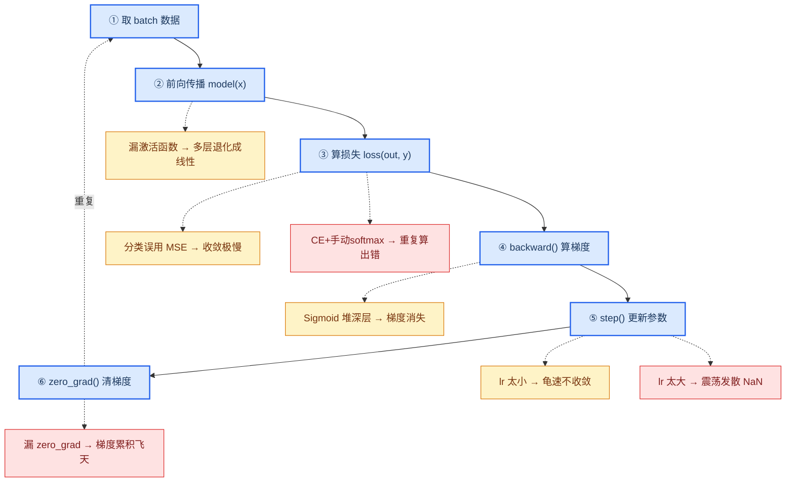

# PyTorch 工程实践要点

> 上一篇把 MLP 的原理讲清楚了。这篇解决一个问题：**那些原理在 PyTorch 代码里到底对应什么？**
> 目标是拆开 `nn.Linear` / `loss.backward()` / `optimizer.step()` 这些"黑盒"，让你看着本项目 `src/` 的代码就能对应到原理，并掌握标准训练套路和调参诊断方法。

---

## 1. 四个核心黑盒拆解

### 1.1 `nn.Linear(in, out)` = 一个 $W\mathbf{x}+\mathbf{b}$

教程里反复出现的 $W\mathbf{x}+\mathbf{b}$，在 PyTorch 里就是一个 `nn.Linear`：

```python
layer = nn.Linear(784, 256)
# 它内部存了：
#   weight: 形状 (256, 784)   ← 就是 W
#   bias:   形状 (256,)       ← 就是 b
```

调用 `layer(x)` 等价于做一次矩阵乘法加偏置：`x @ W.T + b`。所谓训练，就是让这两个张量里的数值变得越来越"对"。

> 对应本项目 `src/model.py` 里的 `layers.append(nn.Linear(prev, h))`——每个隐藏层的第一件事就是它。

### 1.2 `loss.backward()` = 自动反向传播

这一行是 PyTorch 最"魔法"的地方。你只写了前向传播（`model(x)` → `loss`），它凭什么能算出每个参数的梯度？

答案是**自动微分（autograd）**：PyTorch 在你做前向计算时，**偷偷在背后记录了一张"计算图"**——记录每一步用了什么运算、产生了什么中间结果。当你调用 `loss.backward()` 时，它从损失 $L$ 开始，沿着这张图**反向追溯**，用链式法则（见教程 01 第 6 节）逐层算出每个参数的梯度，存进参数的 `.grad` 属性。

```python
loss = criterion(outputs, y)   # 前向：算出损失
loss.backward()                # 反向：自动填好所有 w.grad, b.grad
# 现在 model.parameters() 里每个 w 都有了 w.grad
```

> 你不需要手写链式法则的矩阵推导，PyTorch 替你做了，而且做得又快又准。这就是深度学习框架的核心价值。

### 1.3 `optimizer.step()` = 沿梯度走一步

有了梯度，更新参数就是教程 01 第 7 节的公式 $w \leftarrow w - \eta \cdot \frac{\partial L}{\partial w}$：

```python
optimizer.step()
# 它对每个参数做的事等价于：
#   w = w - lr * w.grad
# （Adam 等优化器会在这个基础上加动量、自适应学习率，但本质都是"按梯度走一步"）
```

### 1.4 `optimizer.zero_grad()` = 清空上次的梯度

PyTorch 的梯度是**累加**的（为了支持梯度累积等高级技巧）。如果不清零，这次的梯度会叠在上一次的上面，越加越大，训练就乱了。所以每次反向传播前必须清零：

```python
optimizer.zero_grad()   # 把所有 w.grad 清零，准备接收本次的梯度
```

> **记忆口诀**：`zero_grad → backward → step`，清零、算梯度、走一步。

---

## 2. 标准训练循环六步曲

把上面四个零件组装起来，就是深度学习训练的标准模板。本项目 `src/train.py` 的 `run_one_epoch` 就是按这个套路写的：

```python
for x, y in train_loader:          # 1. 取一个 batch
    outputs = model(x)             # 2. 前向传播
    loss = criterion(outputs, y)   # 3. 算损失
    optimizer.zero_grad()          # 4. 清梯度
    loss.backward()                # 5. 反向传播（算梯度）
    optimizer.step()               # 6. 更新参数
```

> 这 6 步是几乎所有 PyTorch 训练代码的骨架。不管模型多复杂（CNN、Transformer），核心循环都是这个，只是 `model(x)` 里面的结构不同而已。

**一个 epoch** = 把训练集的所有 batch 走一遍。一次完整训练通常要重复很多个 epoch。

---

## 3. DataLoader：数据怎么喂进网络

```python
train_loader = DataLoader(train_set, batch_size=128, shuffle=True)
```

`DataLoader` 做的事很简单：把数据集切成一个个 `batch_size` 大小的小块，每次 `for x, y in train_loader` 吐出一块。

几个关键参数：
- `batch_size`：每块多大。太小→梯度噪声大、训练慢；太大→内存吃紧、泛化可能变差。MNIST 上 128 是个稳妥默认值。
- `shuffle=True`：每个 epoch 打乱顺序。**训练集一定要打乱**（否则模型会记住数据顺序）；验证/测试集不用打乱。

> 对应本项目 `src/data.py` 的 `get_mnist_loaders`，它还额外从训练集里切了 10% 做验证集（监控泛化）。

---

## 4. 损失函数和优化器的选择

### 4.1 损失函数（criterion）

| 任务类型 | 推荐损失 | PyTorch 写法 |
|---------|---------|-------------|
| 多分类（如 MNIST） | 交叉熵 | `nn.CrossEntropyLoss()`（**内部自带 softmax**，所以模型最后一层不要加 softmax） |
| 二分类 | 二元交叉熵 | `nn.BCEWithLogitsLoss()` |
| 回归 | 均方误差 | `nn.MSELoss()` |

> ⚠️ **新手最常踩的坑**：用了 `nn.CrossEntropyLoss` 却在模型最后手动加了 `softmax`。这等于做了两次 softmax，结果会出错。记住：CrossEntropyLoss = LogSoftmax + NLLLoss，模型只输出原始得分（logits）即可。

### 4.2 优化器（optimizer）

| 优化器 | 适用场景 | 一句话 |
|--------|---------|--------|
| `SGD` | 研究基线、需要精细调参 | 最朴素，但调好了上限高 |
| `SGD(momentum=0.9)` | 大多数场景 | 加了惯性，比纯 SGD 稳 |
| `Adam` / `AdamW` | **默认首选** | 自适应学习率，收敛快、对初始 lr 不敏感 |

> 新手无脑选 `Adam` + `lr=1e-3` 基本不会出错。本项目默认就是它。

---

## 5. 训练曲线诊断手册

训练时盯着两条曲线——**训练损失**和**验证损失**——就能诊断大部分问题。打开 `app.py` 的训练台，调参后对照下表：

### 全流程诊断图：每一步踩坑会怎样

下图把第 2 节的训练循环和"某步出错 → 表现出什么症状"画在了一起，是本手册的速查版。**蓝色**是正常流程，**黄色**是"能跑但效果差"的隐患，**红色**是"训练直接崩溃"的致命错误。



> 💡 **定位口诀**：loss 一直不降 → 查 ⑤③④；loss 突然 NaN → 查 ⑤⑥；能收敛但准确率低 → 查 ②③。

下面的表格给出更详细的"现象 → 原因 → 对策"：

| 现象 | 可能原因 | 对策 |
|------|---------|------|
| 两条曲线都不降 | 学习率太小 / 模型太小 / 数据有问题 | 调大 lr（×10）/ 加宽隐藏层 / 检查数据 |
| 训练损失震荡剧烈 | 学习率太大 / batch 太小 | 调小 lr / 加大 batch_size |
| loss 变成 NaN | 学习率过大（梯度爆炸） | 大幅调小 lr，检查是否有除零 |
| 训练降、验证也降，但都卡在低位 | 欠拟合，模型容量不足 | 加宽/加深网络、训练更多轮 |
| 训练还在降、验证开始升 | **过拟合**（教程 01 第 8 节） | 加 Dropout、加权重衰减、早停、要更多数据 |
| 训练曲线有"台阶" | 学习率偶尔刚好踩进平坦区 | 正常现象，可适当增加 epoch |

> 🎛️ **最好的学习方法**：在训练台里故意制造这些问题（比如 lr 调成 1.0 看 NaN、把网络调成 [8] 看欠拟合、训练 30 轮看过拟合），对照曲线加深理解。

---

## 6. 模型保存与加载

训练好的模型（一组 $W$、$b$ 数值）要保存下来复用：

```python
# 保存（只存参数数值，不存结构）
torch.save(model.state_dict(), "checkpoints/my_model.pt")

# 加载（必须先重建相同结构，再载入数值）
model = MLP(hidden_sizes=[256, 128])          # 结构要和保存时一致
model.load_state_dict(torch.load("my_model.pt"))
model.eval()   # 切到推理模式（关掉 Dropout 等）
```

`state_dict()` 就是"把模型里所有 $W$、$b$ 打包成字典"。本项目 `checkpoints/default_mlp.pt` 就是这么存的，`app.py` 启动时自动加载它，让"预测台/显微镜"开箱即用。

> ⚠️ `model.train()` vs `model.eval()`：前者开启 Dropout 和 BatchNorm 的训练行为，后者关闭。**评估/推理时一定记得 `model.eval()`**，否则 Dropout 会随机丢掉神经元，预测结果不稳定。

---

## 7. 从原理到代码：一张对照表

| 教程 01 的原理 | 本项目的代码位置 |
|---------------|-----------------|
| 神经元 $f(W\mathbf{x}+\mathbf{b})$ | `model.py`: `nn.Linear` + `ACTIVATIONS[activation]()` |
| 前向传播流水线 | `model.py`: `MLP.forward` 的 `self.network(x)` |
| 损失函数 | `train.py`: `criterion(outputs, y)` |
| 反向传播（链式法则） | `train.py`: `loss.backward()` |
| 梯度下降走一步 | `train.py`: `optimizer.step()` |
| 清梯度 | `train.py`: `optimizer.zero_grad()` |
| 学习率 | `train.py`: `TrainingConfig.lr` → `optimizer` 的 `lr` 参数 |
| Dropout | `model.py`: `nn.Dropout(dropout)` |
| 标准化 | `data.py`: `transforms.Normalize((0.1307,), (0.3081,))` |

> **建议**：打开 `src/train.py` 的 `run_one_epoch` 函数，对照上面的六步曲读一遍代码。这是理解 PyTorch 训练最直接的路径。

---

> 下一篇：[03_建模流程与局限性](./03_建模流程与局限性.md) —— 总结用 MLP 建模的通用七步法，以及 MLP 的核心局限（为什么图像任务需要 CNN）。
